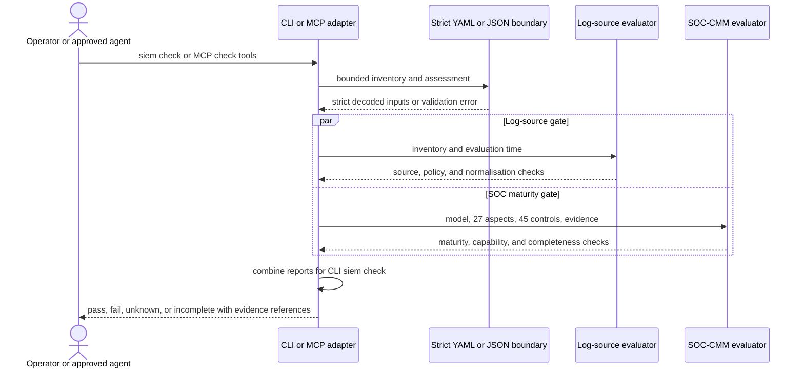
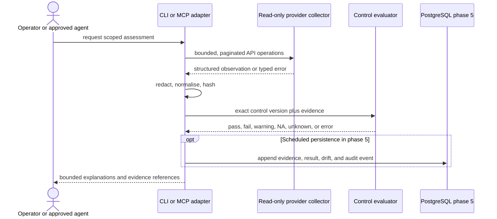
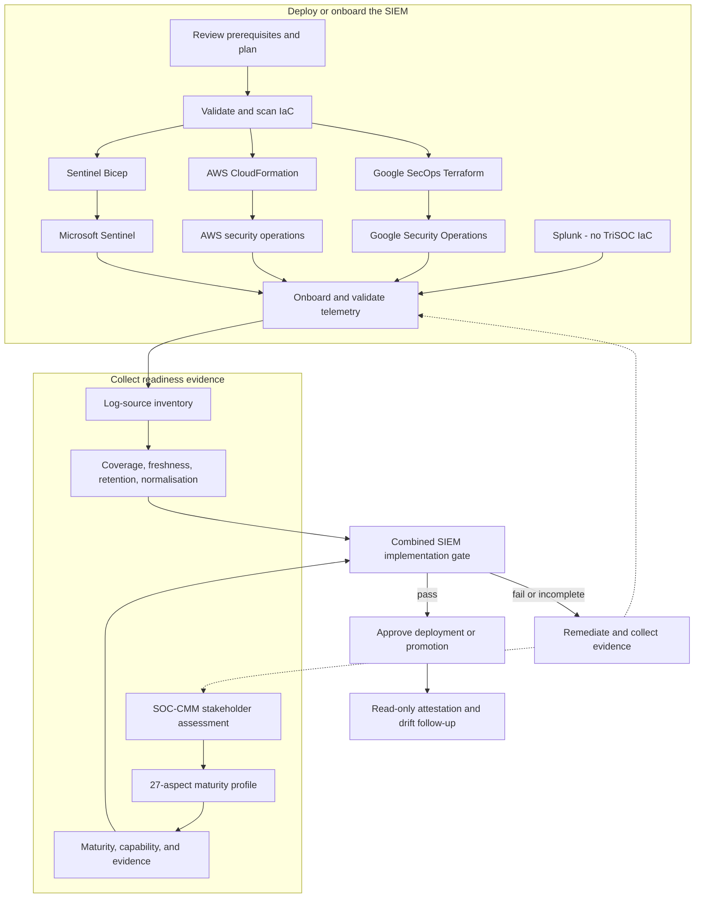

# Architecture

## Boundaries

TriSOC Attestor is a modular monorepo with a Go security core. The CLI, REST API,
worker, and MCP adapters call application services; provider collectors implement
bounded read operations behind provider-specific interfaces; PostgreSQL owns the
canonical schema and append-only record of observations. The optional Next.js UI
is a client of the versioned REST API and does not own attestation truth.

Naming is isolated in `config/product.yaml`. Package paths use domain names such
as `control`, `evidence`, and `mcp`, avoiding product-name coupling.

## Planned repository map

```text
cmd/trisoc/          CLI entry point
internal/control/    control model, strict loader, and deterministic validation
internal/evidence/   redaction and hashing
internal/logsource/  source coverage, freshness, retention, and normalisation
internal/maturity/   SOC-CMM profile, strict loader, and readiness evaluation
internal/mcp/        MCP transport and read-only tools
controls/            reviewed, versioned control packs and JSON Schema
migrations/          canonical backend-owned PostgreSQL schema
config/              replaceable product presentation settings
apps/                API, worker, web, and docs applications as phases land
providers/           Microsoft, AWS, and Google collectors as phases land
deploy/              Docker, Helm, Bicep, CloudFormation, and Terraform assets
docs/adr/             architecture decision records
```

Folders are added when they contain functioning code; the roadmap does not use
empty directories to imply that unavailable provider features exist.

## Readiness and attestation data flow

The readiness path uses only declared, bounded assessment inputs. The CLI
combines the reports for `trisoc siem check`; MCP clients receive the two reports
from separate read-only tools and combine them in their approved workflow.

### SIEM readiness



### Provider attestation



Collection failure bypasses compliance evaluation and becomes `unknown` or
`error`. Applicability runs before collection. Technical failure remains present
under an accepted exception.

## SIEM implementation lifecycle



Splunk participates in CIM and operational-readiness checks but has no TriSOC
deployment baseline. The CLI combines both readiness reports in `trisoc siem
check`; MCP clients call `check_log_sources` and `check_soc_maturity` separately
and combine them in the approved agent workflow.

## Write safety

Assessment and planning are distinct from execution. A plan is content-addressed.
Approval binds an authenticated human, organisation, exact plan hash, scope, and
expiry. Apply re-checks the hash and preconditions, consumes the approval against
replay, applies only with explicit CLI `--apply`, records every step, and triggers
targeted validation. Destructive plans are never automatic.

## Persistence and tenancy

All tenant-owned tables carry `organisation_id`; service queries must scope by it.
Foreign keys preserve provenance from an assessment to its exact control version
and evidence. Database triggers prohibit updates or deletion of evidence,
results, bundles, approvals, exception decisions, and audit events. Application
tests will add PostgreSQL row-level security and cross-tenant negative cases
before multi-tenant hosting is supported.

## Observability

Structured JSON logs are mandatory and secrets are redacted before logging.
OpenTelemetry traces and Prometheus metrics arrive with the API/worker phase.
Metrics must use bounded labels; cloud resource IDs and tenant IDs are not metric
labels.
