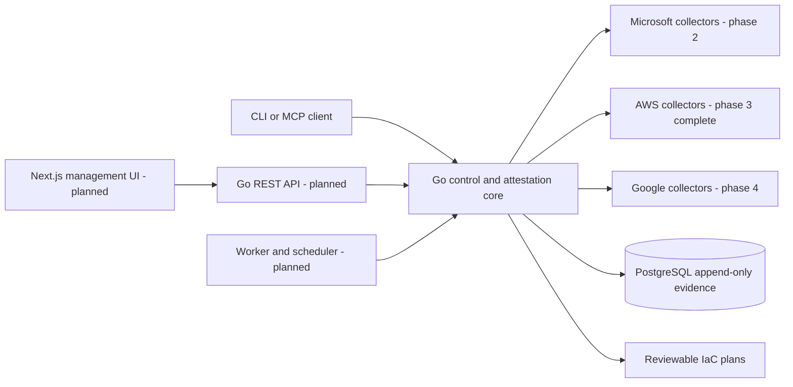

# TriSOC Attestor

TriSOC Attestor builds, validates and continuously attests Microsoft Sentinel,
AWS-native security operations, and Google Security Operations environments
against reviewed vendor guidance.

The foundation, Microsoft Sentinel provider, and AWS-native security operations
provider are implemented: strict versioned controls, canonical PostgreSQL schema,
redacted evidence hashing, real vendor SDK-backed read-only discovery,
deterministic attestation, drift comparison, reviewable IaC planning, CLI
workflows, and local MCP tools. Google provider support follows in phase 4.

> TriSOC Attestor assists with deployment and continuous attestation. It does
> not guarantee security, replace incident response, or replace qualified cloud
> and security architecture review. Inaccessible evidence is never a pass.

## What works now

- Strict YAML decoding and deterministic validation of control metadata,
  official source domains, lifecycles, remediation safety, and CEL expressions.
- Ten active Microsoft Sentinel controls and ten active AWS-native security
  operations controls, plus a reviewed Google example.
- Recursive sensitive-value redaction followed by deterministic SHA-256
  evidence hashing.
- PostgreSQL schema covering organisations, immutable assessments and evidence,
  drift, findings, telemetry, detections, approvals, exceptions, and audit data.
- CLI control validation with human, JSON, and YAML output.
- CLI and MCP log-source compliance checks covering freshness, retention, and
  normalisation for Sentinel/ASIM, Security Lake/OCSF, Google SecOps/UDM, and
  Splunk/CIM.
- A combined SIEM implementation gate using all 27 SOC-CMM 2.4.2 Basic aspect
  results plus evidence-backed Log Management and Log Monitoring controls.
- MCP over stdio and stateless Streamable HTTP with control catalogue tools and
  read-only Sentinel/AWS discovery and attestation plus Bicep/CloudFormation planning.
- Official Azure and AWS SDK integrations. AWS covers Organizations, GuardDuty,
  Security Hub CSPM, CloudTrail, Config, optional Security Lake, and optional
  OpenSearch inventory selected only by architecture.
- Loopback-only networking by default, bounded MCP inputs and outputs, and no
  write tools in the first release slice.
- Plan-first deployment baselines for Microsoft Sentinel (Bicep), AWS-native
  security operations (CloudFormation), and Google Security Operations
  (Terraform); Splunk deployment is intentionally excluded.

Google discovery, remediation application, scheduling, reports, and the
management UI are explicitly roadmap work—not mock implementations.

## Architecture



See [ARCHITECTURE.md](ARCHITECTURE.md) and the [architecture decisions](docs/adr/README.md).

## Five-minute local setup

Prerequisites: Docker with Compose, or Go 1.25+ for a native build.

```sh
docker compose up --build -d
curl -fsS http://127.0.0.1:8787/healthz
docker compose exec attestor controls validate /app/controls
```

Compose publishes PostgreSQL and MCP only on loopback. Set a non-default
`POSTGRES_PASSWORD` in `.env` for any environment beyond disposable local use.
The migration is applied by PostgreSQL only when its data volume is first
created; later releases will use a dedicated migration runner.

Native use:

```sh
go build -o bin/trisoc ./cmd/trisoc
./bin/trisoc controls validate controls
./bin/trisoc siem check --log-sources examples/log-source-inventory.yaml --maturity examples/soc-maturity-assessment.yaml --at 2026-07-16T08:00:00Z
./bin/trisoc mcp serve --transport stdio
```

The combined check is the deployment gate: it requires compliant log-source
coverage and normalisation as well as a complete SOC-CMM profile. See
[log-source compliance](docs/LOG_SOURCE_COMPLIANCE.md), the
[SOC maturity gate](docs/SOC_MATURITY.md), and the
[deployment IaC](docs/SIEM_IAC.md).

## Read-only first scan

The first real Microsoft Sentinel scan is:

```sh
trisoc azure discover --subscription ID --resource-group RG --workspace NAME --output json
trisoc azure attest --subscription ID --resource-group RG --workspace NAME --expected-tables SigninLogs,AuditLogs
```

For AWS, select the architecture explicitly; OpenSearch is never assumed merely
because AWS support is enabled:

```sh
trisoc aws discover --home-region ap-southeast-2 --regions ap-southeast-2,us-east-1 --architecture security_hub_findings_centric --output json
trisoc aws attest --home-region ap-southeast-2 --regions ap-southeast-2,us-east-1 --require-delegated-admins --securityhub-standards aws-foundational-security-best-practices
trisoc aws plan --trail-name trisoc-organization-trail --output cloudformation
```

Discovery and attestation are read-only. Evidence collection errors
produce `unknown` or `error`, never `fail` or `pass`.

## MCP setup

Build the binary, then configure a local client to start it with stdio:

```json
{
  "mcpServers": {
    "trisoc-attestor": {
      "command": "/absolute/path/to/trisoc",
      "args": ["mcp", "serve", "--transport", "stdio"],
      "env": {"TRISOC_CONTROL_DIR": "/absolute/path/to/controls"}
    }
  }
}
```

The same shape works for Claude Code and generic stdio MCP clients. For Codex,
add the server using the Codex MCP configuration for your installation and use
the same command, arguments, and environment. See [MCP.md](MCP.md) for protocol
details and a manual smoke test.

Example daily prompt for the completed product:

> Run today’s read-only attestation across all configured cloud security
> operations environments. Compare it with the previous successful attestation.
> Prioritise newly failed controls, missing telemetry, disabled detections,
> unhealthy connectors, and expired exceptions. Explain material changes in
> plain English. Do not apply remediation. Generate reviewable plans for
> critical and high-severity findings.

The current MCP server can inspect controls and assess an explicitly scoped
Sentinel workspace or AWS security-operations estate. Multi-environment daily
orchestration remains phase 5 work.

## Security model

- Read-only is the default and the current MCP surface has no cloud write path.
- Control files are data, never executable shell, JavaScript, Python, or Go.
- CEL is parsed and type-checked in a sandboxed environment with only an
  `evidence` value available.
- YAML aliases, custom tags, unknown fields, oversized documents, and unofficial
  primary source hosts are rejected.
- Persisted evidence must be redacted before it is hashed or stored.
- Historical security records are immutable at the database layer.
- Future apply operations require a displayed plan, a bound and expiring human
  approval, separate apply intent, and post-change validation.

Read [THREAT_MODEL.md](THREAT_MODEL.md), [SECURITY.md](SECURITY.md), and
[REMEDIATION_SAFETY.md](REMEDIATION_SAFETY.md) before deployment.

## Seed guidance

The initial examples are tied to official sources retrieved on 14 July 2026:

- [Microsoft Sentinel auditing and health monitoring](https://learn.microsoft.com/en-us/azure/sentinel/enable-monitoring)
- [AWS Security Hub CSPM controls for CloudTrail](https://docs.aws.amazon.com/securityhub/latest/userguide/cloudtrail-controls.html)
- [Google Cloud aggregated logging sinks](https://docs.cloud.google.com/logging/docs/export/aggregated_sinks_overview)

The shipped controls remain a deliberately bounded seed pack. See
[CONTROL_AUTHORING.md](CONTROL_AUTHORING.md).

## Roadmap

1. Foundation: this pull request scope.
2. Microsoft Sentinel collectors and ten high-value controls.
3. AWS Organizations and native security-operations collectors and controls: complete.
4. Google Security Operations and Security Command Center collectors and controls.
5. Scheduler, drift, signed bundles, exceptions, notifications, and reports.
6. Accessible management interface and local authentication.
7. Enterprise identity, isolation, Helm, KMS signing, and HA workers.
8. Signed community control packs and a governed registry.

The proposed GitHub milestone and issue inventory is in [docs/ROADMAP.md](docs/ROADMAP.md).

## Limitations

- Google provider APIs are not implemented yet.
- AWS discovery currently assumes the executing or assumed role can read the
  organization and configured Regions; member-account fan-out is the next AWS
  expansion and inaccessible evidence is reported as unknown.
- Sentinel currently targets one explicitly named workspace per command and does
  not persist the result to PostgreSQL; scheduled persistence begins in phase 5.
- HTTP MCP is stateless and binds to loopback by default; a non-loopback native
  bind requires an explicit bearer token and TLS termination remains external.
- Guidance hashes cover fetched HTML and can change due to non-substantive page
  changes. The planned synchroniser will retain snapshots and open human review.
- JSON canonicalisation currently uses Go's deterministic JSON encoding. A
  formal cross-language canonicalisation profile will be selected before signed
  attestation bundles ship.

## Contributing

Start with [CONTRIBUTING.md](CONTRIBUTING.md). Controls require official guidance,
deterministic validation, tests, a retrieval hash, and human review.
